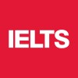
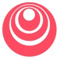
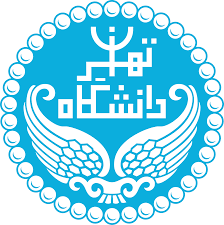

<!-- 




 -->

# About Me  
I’m **Mahdis Sepahvand**, a **Computer Engineering** undergraduate at **Shahid Beheshti University**.
My academic and research interests lie at the intersection of **computer vision**, **deep learning**, **medical imaging**, and **generative & diffusion models**. I am also passionate about exploring **multimodal learning and data-driven applications** in **science** and **healthcare**.

For my Bachelor’s project, I worked on **fine-tuning large multimodal models** for **medical image** analysis — an experience that deepened my interest in integrating AI techniques with real-world medical challenges.
I’m eager to pursue **Master’s or direct PhD opportunities** where I can continue researching in these fields and contribute to meaningful, interdisciplinary AI projects.

Outside of academia, I enjoy writing, reading books, and listening to music, which help me stay creative and inspired.

You can reach me via:
- [Email](mailto:Mahdissep18@gmail.com)
- [Telegram](https://t.me/mahdissep)

# Education

  

    

      <strong>Sep 2021 - Jan 2026</strong> 
      Bachelor, Computer Engineering, Shahid Beheshti Univeristy, Tehran, Iran
    

    

      Cumulative: 18.09/20 (3.77/4.00)
      Last two years: 19.07/20 (4.00/4.00)
    

    <!-- Courses, names only, continuous with commas -->
    

      <strong>Relevant 4/4 Courses: </strong> 
      Computer Vision
      Machine Learning
      
      Bachelor Thesis (Multimodal-AI-Odontogenic-Cyst-Diagnosis | <a href="https://github.com/MahdisSep/Multimodal-AI-Odontogenic-Cyst-Diagnosis.git">My Bachelor Thesis</a>)
      Graph Theory and Algorithms
      Algorithms Design
      Data Structures
      Linear Algebra
      Probability &amp; Statistics
      Data Base
    

  

  

    
  

  

    

      <strong>Sep 2019 – Jan 2021</strong> 
      Diploma, Mathematics & Physics, National Organization for Development of Exceptional Talents (Sampad), Iran
    

    

      GPA: 4.00/4.00
      Ranked 1st in the school
    

  

  

    
  

## Languages

  Persian — Native
  English — IELTS 6.5

# Publications

## Bachelor Thesis

  

    In Progress
    
  

  

    <h3 class="pub-title"> A multimodal AI framework for the diagnosis of Odontogenic Cysts</h3>

    <!-- (Text unchanged) -->
    

      This ongoing research project focuses on developing a multimodal deep learning framework for the diagnosis of odontogenic cysts.Our approach integrates data from panoramic radiography (radiomics), histopathology (digital pathology), and clinical/demographic records, enabling the model to learn complementary features from each modality.We fine-tuned the Qwen2.5-7B large multimodal model using the QLoRA optimization technique, achieving a diagnostic accuracy of up to 92%, significantly outperforming unimodal baselines.This work is still in progress and will be further expanded into a research paper in the near future. More updates coming soon!
    

  

# Experience
For additional details about each experience, please see my CV or contact me.

<section class="experience-list">

  <article class="exp-card">
    
    

      <header class="exp-card__header">
        <h3 class="exp-card__role">Undergraduate Research and Teaching Assistant (Part-time)</h3>
        
Tehran, Iran

      </header>

      
Shahid Beheshti University — Computer Science Faculty

      

        Managed assignments, ran recitations, mentored projects, and managed teams as a head teaching assistant.
      

      

        
Course list

        <ul class="exp-card__bullets">
          <li><strong>Computer Vision (A collaborative project with the Faculty of Medicine, University of Tehran)</strong> — Fall 2025, Dr. Hamed Malek, Dr. Nazanin Mahdavi</li>
          <li><strong>Compiler Design (Head Teaching Assistant)</strong> — Fall 2024, Dr. Mehran Alidoost Nia</li>
          <li><strong>Algorithm Design</strong> — Fall 2024, Dr. Farokh Legha Moazemi</li>
          <li><strong>Formal Languages & Automata Theory Course (Head Teaching Assistant)</strong> — Spring 2024, Dr. Ramak Ghavami Zadeh</li>
          <li><strong>Algorithm Design</strong> — Spring 2024, Dr. Ramak Ghavami Zadeh</li>
          <li><strong>Advanced Programming</strong> — Spring 2023, Dr. Sadegh Ali Akbari</li>
          <li><strong>Formal Languages & Automata Theory Course</strong> — Spring 2023, Dr. Ramak Ghavami Zadeh</li>
          <li><strong>Introduction to Programming</strong> — Fall 2022, Dr. Sadegh Ali Akbari</li>
        </ul>
      

    

  </article>
</section>

# Courses

  

    

      IELTS Academic
    

    
IELTS Official, Issued Sep 2025

  

  

    
  

  

    

      Unsupervised Learning, Recommenders, Reinforcement Learning
    

    
DeepLearning.AI, Issued Mar 2025

    <a class="cert-link" href="https://www.coursera.org/account/accomplishments/records/5HQYM7PKHX4Z">View credential</a>
  

  

    
  

  

    

      Advanced Learning Algorithms
    

    
DeepLearning.AI, Issued Oct 2024

    <a class="cert-link" href="https://www.coursera.org/account/accomplishments/records/LYD09SFN7KK8">View credential</a>
  

  

    
  

  

    

      Supervised Machine Learning: Regression and Classification
    

    
DeepLearning.AI, Issued Apr 2024

    <a class="cert-link" href="https://www.coursera.org/account/accomplishments/records/9M7SBTAHATYA">View credential</a>
  

  

    
  

  

    

      Introduction to Databases
    

    
Meta, Issued Sep 2023

    <a class="cert-link" href="https://www.coursera.org/account/accomplishments/records/BBKN8JZBC2P5">View credential</a>
  

  

    
  

  

    

      Deep Learning Course
    

    
University of Tehran, ACM, Issued Summer 2024

    <a class="cert-link" href="https://drive.google.com/file/d/1yM4jr7wKAeMP3Gsu9m0jof2VCjKjWLAb/view?usp=sharing">View credential</a>
  

  

    
  

  

  

    

      Machine Learning and Data Science
    

    
Iran University of science and technology, Computernic, Issued Summer 2023

    <a class="cert-link" href="https://drive.google.com/file/d/1gukQEzuG4HfpNKtIw4E7LIabVlXEetH9/view?usp=sharing">View credential</a>
  

  

    
  

  

    

      Introduction to linux
    

    
Shahid Beheshti University, Issued Summer 2022

    <a class="cert-link" href="https://drive.google.com/file/d/1Uc0ZVzI_57kB7DJfhhPUF26RCZf9XE-r/view?usp=sharing">View credential</a>
  

  

    
  

  

    

      Fundamentals of Python
    

    
Shahid Beheshti University, Issued Summer 2022

     <a class="cert-link" href="https://drive.google.com/file/d/1zhIBX-m2hb-LuaCxnPBB0B6O9MrOv_Pr/view?usp=sharing">View credential</a>
  
   
  

    
  

  

    

      Computer vision
    

    
Shahid Beheshti University, Issued Winter 2023

    <a class="cert-link" href="https://drive.google.com/file/d/1CHhlvweQD3QqxTDmC95tLj4Jf80qj20-/view?usp=sharing">View credential</a>
  

  

    
  

<!--  -->

 
 
 
 